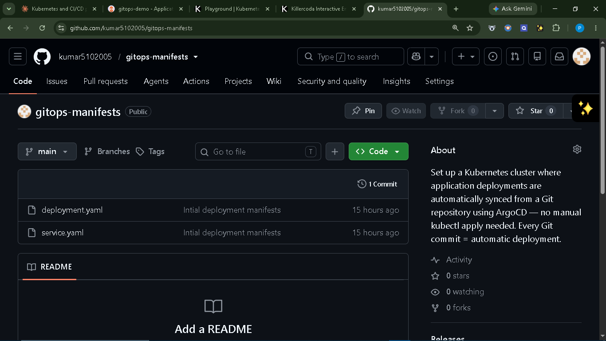
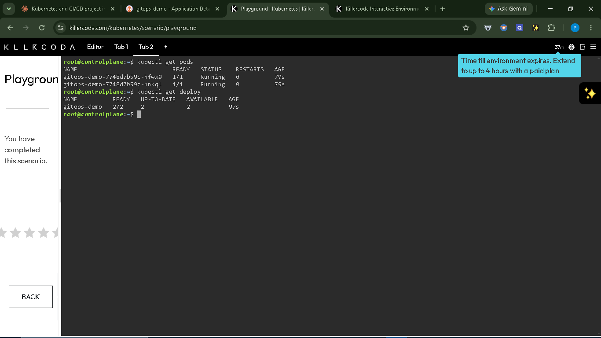
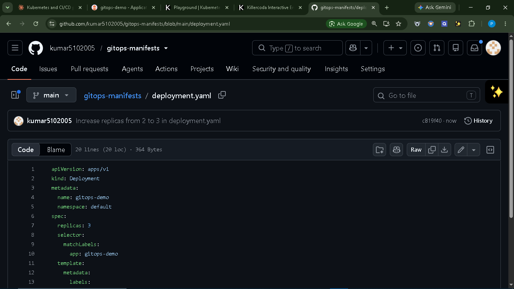
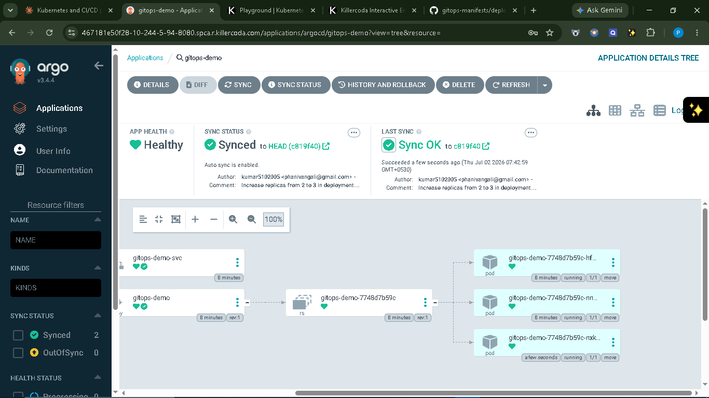
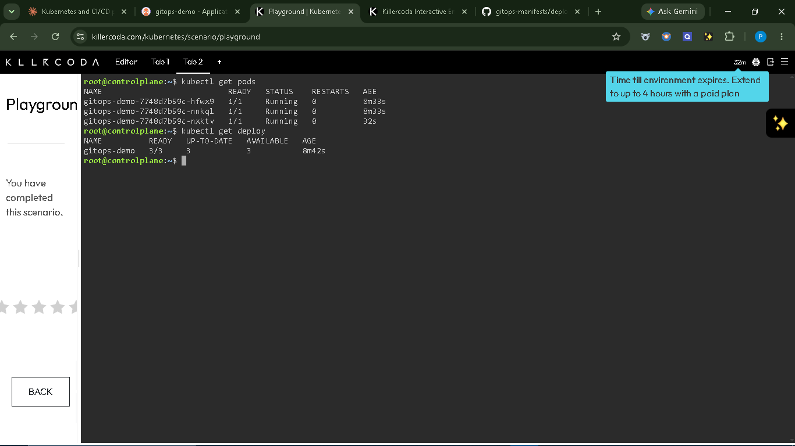
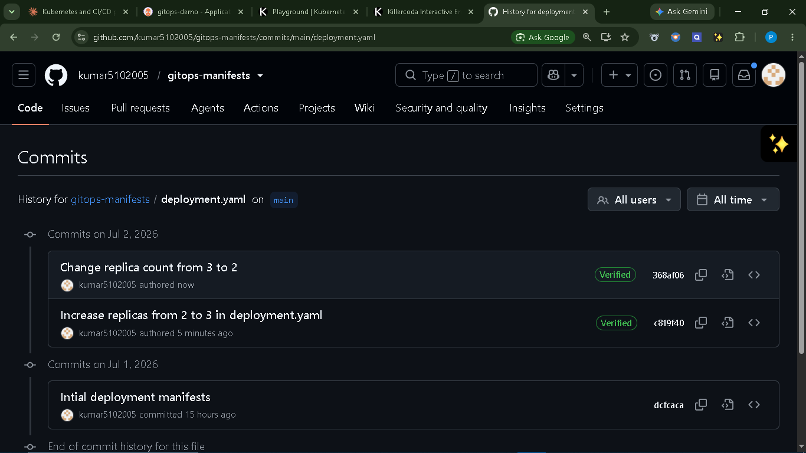
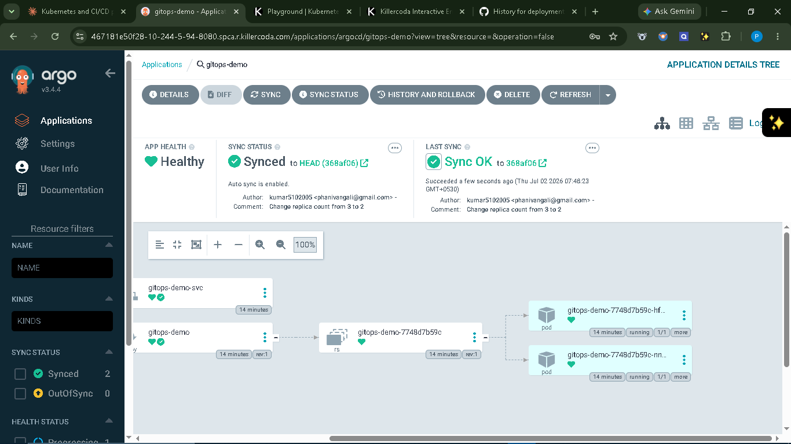
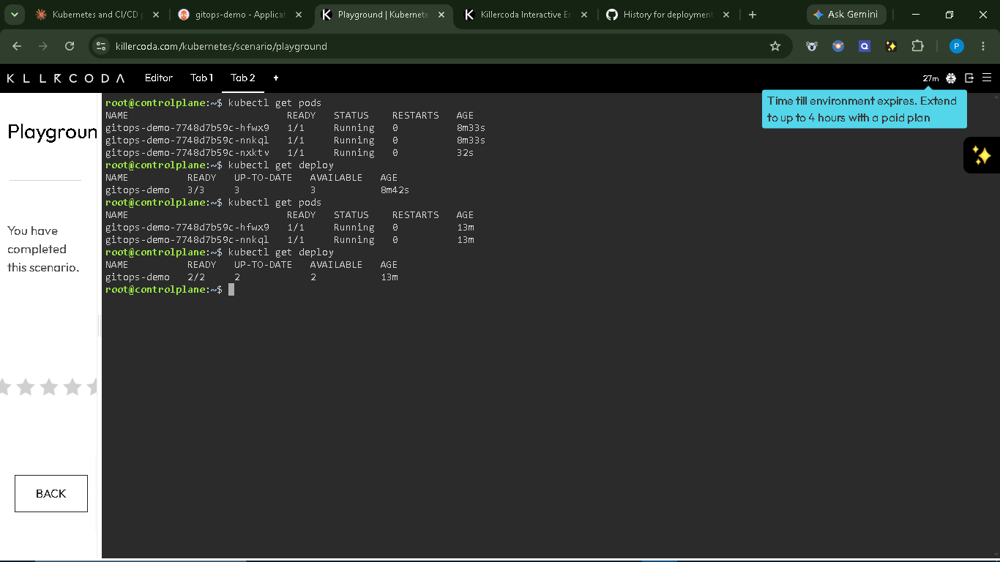
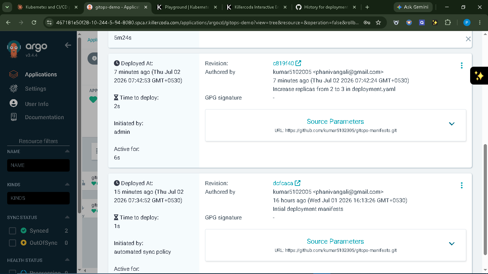

# GitOps Workflow using ArgoCD on Kubernetes

A hands-on implementation of a GitOps CI/CD pipeline where Kubernetes deployment
state is automatically synced from this Git repository using **ArgoCD** — no
manual `kubectl apply` needed. Every Git commit results in an automatic,
auditable deployment to the cluster.

## 📌 Objective

Implement GitOps by syncing Kubernetes deployment states directly from a Git
repository, and demonstrate that scaling and rollbacks can be achieved purely
through Git commits.

## 🛠️ Tools Used

- **Kubernetes** — cluster provisioned via Killercoda's online Kubernetes Playground
- **ArgoCD** — GitOps continuous delivery controller
- **GitHub** — this repository, acting as the single source of truth
- **kubectl** — cluster verification
- **nginxdemos/hello** — sample containerized app

## 📂 Repository Contents

| File | Description |
|------|-------------|
| `deployment.yaml` | Kubernetes Deployment manifest for the sample app |
| `service.yaml` | Kubernetes Service manifest exposing the app |

## 🔄 GitOps Workflow

1. Deployed ArgoCD onto a Kubernetes cluster and connected it to this repository with **automated sync** and **self-heal** enabled.
2. ArgoCD continuously monitors this repo — any change pushed here is automatically applied to the cluster.
3. Demonstrated a **scale-up** by editing `replicas: 2 → 3` in `deployment.yaml` and committing — ArgoCD auto-detected and synced the change.
4. Demonstrated a **rollback** by reverting that commit — ArgoCD automatically scaled the cluster back down to 2 pods.
5. No manual `kubectl` commands were used to deploy or roll back — Git was the only interface used.

## 📸 Screenshots

### 1. Initial Setup — Manifests Pushed to GitHub

### 2. ArgoCD — Initial Application Synced & Healthy (2 pods)

### 3. kubectl — Confirming 2 Pods Running Initially

### 4. GitHub Commit — Replicas Changed from 2 to 3

### 5. ArgoCD — Auto-Synced to 3 Pods After Commit

### 6. kubectl — Confirming Scale-Up to 3 Pods

### 7. GitHub — Revert Commit (3 → 2) in Commit History

### 8. ArgoCD — Auto-Synced Back to 2 Pods (Rollback)

### 9. Terminal Transcript — Scale-Up & Rollback Verified via kubectl

### 10. ArgoCD — History & Rollback Panel (Full Deployment Timeline)

## ✅ Key Takeaways

- **Git as single source of truth** — the cluster state always matches this repo.
- **Zero manual cluster access** — deployments and rollbacks happen purely via Git commits.
- **Full audit trail** — every change is a Git commit with author, timestamp, and message.
- **Self-healing** — ArgoCD automatically corrects any drift between the cluster and Git.

## 👤 Author

**Vangali Phani Kumar**
Rajiv Gandhi University of Knowledge Technologies, Ongole
Elevate Labs DevOps Internship Project
